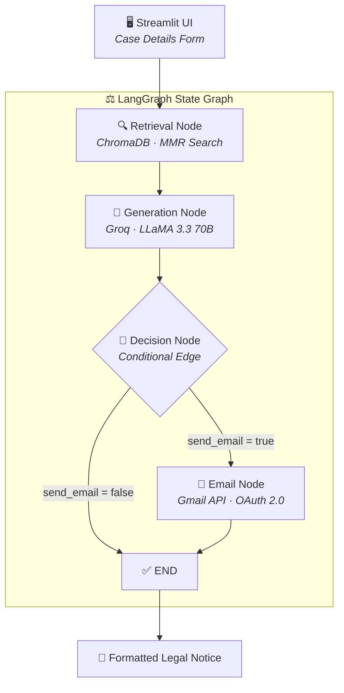

<p align="center">
  
</p>

<p align="center">
  <em>Agentic AI system for automated Indian legal notice generation using LangGraph, RAG, and LLM orchestration</em>
</p>

<p align="center">
  
  
  
  
  
  
  
</p>

---

## 📌 About

**VIDHI** (_Sanskrit: विधि — meaning "Law"_) is a full-stack **Agentic AI system** that automates the end-to-end workflow of generating formal Indian legal notices.

It combines **Retrieval-Augmented Generation (RAG)** with a **stateful multi-node LangGraph pipeline** to produce legally accurate, context-aware notices grounded in Indian legislation — all orchestrated through an autonomous agent graph with **conditional routing** and **decision-making** capabilities.

<br/>

### ✨ What Makes It Agentic?

```
   🔍 Perceives    →    🧠 Reasons    →    🔀 Decides    →    ⚡ Acts
   RAG Retrieval        LLM Generation      Conditional        Gmail
   from ChromaDB        with context         Routing           Dispatch
```

The system autonomously **retrieves** legal precedents, **generates** a notice, **decides** whether to email it, and **acts** by dispatching via Gmail — no human intervention between steps.

---

## 🏗️ Architecture



---

## 🚀 Features

<table>
<tr>
<td width="50%">

### 🤖 Agentic AI Pipeline
- Stateful **LangGraph StateGraph** with typed state
- **Conditional branching** via autonomous decision node
- **4-node orchestration** — retrieval → generation → decision → email
- Error-resilient with state-level error propagation

</td>
<td width="50%">

### 📚 RAG System
- **ChromaDB** vector database with persistent storage
- **MMR (Max Marginal Relevance)** for diverse retrieval
- **HuggingFace sentence-transformers** for local embeddings
- Legal-aware **recursive text splitting** for PDFs

</td>
</tr>
<tr>
<td width="50%">

### 🧠 LLM Integration
- **Groq Cloud** inference — LLaMA 3.3 70B Versatile
- Structured **prompt engineering** for legal formatting
- Auto-maps **IPC → BNS**, **CrPC → BNSS** (2023 new laws)
- Hallucination prevention via grounded generation

</td>
<td width="50%">

### 📧 Gmail + Web UI
- **OAuth 2.0** authentication with token caching
- Automated **cover email** drafting with internal summary
- **Streamlit** dark-themed premium UI
- Real-time **pipeline status** tracking

</td>
</tr>
</table>

---

## 🛠️ Tech Stack

<table>
<tr>
<th>Layer</th>
<th>Technology</th>
<th>Purpose</th>
</tr>
<tr><td><b>AI Framework</b></td><td>LangChain · LangGraph</td><td>LLM orchestration, agentic state graph</td></tr>
<tr><td><b>LLM</b></td><td>Groq Cloud (LLaMA 3.3 70B)</td><td>Legal notice text generation</td></tr>
<tr><td><b>Vector Database</b></td><td>ChromaDB</td><td>Persistent embedding storage</td></tr>
<tr><td><b>Embeddings</b></td><td>HuggingFace sentence-transformers</td><td>Local model (all-MiniLM-L6-v2)</td></tr>
<tr><td><b>Document Processing</b></td><td>PyPDF · RecursiveCharacterTextSplitter</td><td>PDF parsing and legal-aware chunking</td></tr>
<tr><td><b>Frontend</b></td><td>Streamlit</td><td>Interactive web application</td></tr>
<tr><td><b>Email</b></td><td>Gmail API (OAuth 2.0)</td><td>Legal notice email dispatch</td></tr>
<tr><td><b>Language</b></td><td>Python 3.13</td><td>Core application</td></tr>
</table>

---

## 📁 Project Structure

```
Project_Vidhi/
│
├── main.py                       # Streamlit app — UI + pipeline invocation
├── setup_rag.py                  # One-time script to build ChromaDB from PDFs
├── requirements.txt              # Python dependencies
│
├── data/
│   └── pdfs/                     # Legal PDF documents for knowledge base
│       ├── BNS.pdf
│       ├── Bhartiya Sakshya Adhiniyam.pdf
│       └── Constitution Law.pdf
│
└── src/
    ├── prompts.py                # ChatPromptTemplate definitions
    ├── gmail_service.py          # Gmail OAuth + email service
    │
    ├── graph/
    │   ├── state.py              # LegalAgentState (TypedDict)
    │   ├── nodes.py              # retrieval · generation · decision · email
    │   └── graph_builder.py      # StateGraph assembly & compilation
    │
    ├── rag/
    │   ├── pdf_loader.py         # PDF loading & document extraction
    │   └── vector_store.py       # ChromaDB build · load · retriever
    │
    └── utils/
        └── config.py             # Environment variable management
```

---

## ⚡ Quick Start

### Prerequisites

> **Required:** Python 3.10+ · [Groq API Key](https://console.groq.com) (free)
> **Optional:** Gmail OAuth credentials (for email dispatch)

### 1️⃣ Clone & Setup

```bash
git clone https://github.com/kusal49/Project_Vidhi-.git
cd Project_Vidhi-
python -m venv venv
source venv/bin/activate
pip install -r requirements.txt
```

### 2️⃣ Configure Environment

Create a `.env` file:

```env
GROQ_API_KEY=your_groq_api_key_here
CHROMA_PERSIST_DIR=data/chroma_db

# Optional
GMAIL_CREDENTIALS_PATH=credentials.json
GMAIL_TOKEN_PATH=token.json
LANGCHAIN_TRACING_V2=false
```

### 3️⃣ Build Knowledge Base

```bash
# Place legal PDFs in data/pdfs/ then run:
python setup_rag.py
```

### 4️⃣ Launch

```bash
streamlit run main.py
```

---

## 🔄 Pipeline Flow

| Step | Node | What Happens |
|:----:|------|-------------|
| **1** | 🔍 **Retrieval** | Queries ChromaDB with MMR search → fetches top-5 relevant legal provisions from embedded PDFs |
| **2** | 🤖 **Generation** | Injects retrieved context into structured prompt → generates formal notice via Groq LLaMA 3.3 70B |
| **3** | 🔀 **Decision** | Conditional edge autonomously routes to email node or ends pipeline based on user config |
| **4** | 📧 **Email** | Drafts professional cover email → dispatches notice via Gmail API using OAuth 2.0 |

---

## ⚖️ Supported Legal Categories

| Category | Key Legislation |
|:---------|:---------------|
| 👔 Employment Dispute | Industrial Disputes Act · Payment of Wages Act · POSH Act |
| 🛒 Consumer Dispute | Consumer Protection Act 2019 · RERA · E-Commerce Rules |
| 🏠 Property Dispute | Transfer of Property Act · Specific Relief Act · Rent Control |
| 🏦 Cheque Bounce | Negotiable Instruments Act (Section 138) |
| 📢 Defamation | BNS 356 (erstwhile IPC 499/500) · Tort Law |
| 💰 Recovery of Money | Indian Contract Act · CPC Order 37 · Limitation Act |
| 🏥 Medical Negligence | Consumer Protection Act · Medical Council Regulations |
| 💻 Cyber Crime | IT Act 2000 (Sections 43, 66, 66C, 66D) |
| ©️ Intellectual Property | Trade Marks Act 1999 · Copyright Act 1957 |
| 👨‍👩‍👧 Family Law | BNSS 144 (erstwhile CrPC 125) · Hindu Marriage Act |

---

## 🔑 Technical Highlights

- **Agentic AI Design** — Autonomous multi-step reasoning with perception → decision → action loop
- **Grounded Generation** — RAG pipeline eliminates LLM hallucination by citing only retrieved provisions
- **Prompt Engineering** — Structured system prompts with legal formatting constraints and new law mapping
- **State Management** — TypedDict-based immutable state with node-level isolation
- **Vector Search** — MMR balances relevance and diversity in retrieved legal precedents
- **OAuth 2.0** — Secure Gmail authentication with automatic token refresh and caching
- **Modular Architecture** — Clean separation across graph, RAG, prompts, and service layers

---

<p align="center">
  <sub>Built with ❤️ using LangChain · LangGraph · Groq · ChromaDB · Streamlit</sub>
</p>

<p align="center">
  <a href="https://github.com/kusal49"></a>
</p>
