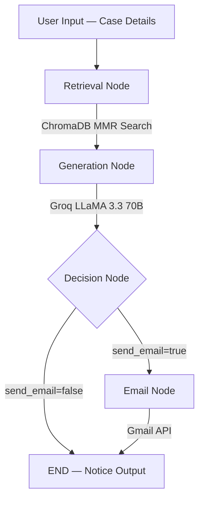

<


---

## 📌 Project Overview

**VIDHI** (_Sanskrit: विधि — meaning "Law"_) is a full-stack **Agentic AI system** that automates the end-to-end workflow of generating formal Indian legal notices. It combines **Retrieval-Augmented Generation (RAG)** with a **stateful multi-node LangGraph pipeline** to produce legally accurate, context-aware notices grounded in Indian legislation.

The system retrieves relevant legal provisions from a **ChromaDB vector store** (populated from PDF documents of Indian law), uses **Groq's LLaMA 3.3 70B** model for generation, and optionally dispatches the notice via **Gmail API** — all orchestrated through an autonomous agent graph with conditional routing and decision-making capabilities.

---

## 🏗️ System Architecture

```
┌─────────────────────────────────────────────────────────┐
│                   STREAMLIT WEB UI                      │
│          (Case Input Form + Notice Output)              │
└────────────────────────┬────────────────────────────────┘
                         │
                         ▼
┌─────────────────────────────────────────────────────────┐
│              LANGGRAPH STATE GRAPH                      │
│                                                         │
│   [START]                                               │
│      │                                                  │
│      ▼                                                  │
│   retrieval_node ──── ChromaDB (MMR Search)             │
│      │                   │                              │
│      │          HuggingFace Embeddings                  │
│      │        (sentence-transformers)                   │
│      ▼                                                  │
│   generation_node ──── Groq API (LLaMA 3.3 70B)        │
│      │                                                  │
│      ▼                                                  │
│   decision_node (Conditional Edge)                      │
│      │              │                                   │
│      ▼              ▼                                   │
│   email_node       END                                  │
│   (Gmail API)                                           │
│      │                                                  │
│      ▼                                                  │
│     END                                                 │
└─────────────────────────────────────────────────────────┘
```

---

## 🚀 Key Features

### Agentic AI Pipeline
- **Stateful graph-based workflow** using LangGraph `StateGraph` with typed state management
- **Conditional branching** — autonomous decision-making node routes between email dispatch or completion
- **Multi-node orchestration** — retrieval → generation → decision → email, executed autonomously
- **Error-resilient design** — each node handles exceptions independently with state-level error propagation

### RAG (Retrieval-Augmented Generation)
- **ChromaDB vector database** for persistent storage of legal document embeddings
- **Max Marginal Relevance (MMR) search** for diverse, relevant legal precedent retrieval
- **HuggingFace sentence-transformers** (`all-MiniLM-L6-v2`) for local, free embedding generation
- **PDF document ingestion pipeline** with recursive text splitting optimized for legal text
- **Grounded generation** — LLM responses cite only retrieved legal provisions, preventing hallucination

### LLM Integration
- **Groq Cloud inference** with LLaMA 3.3 70B Versatile model for high-quality legal text generation
- **Prompt engineering** with structured templates for consistent legal notice formatting
- **New Indian criminal law mapping** — automatically converts IPC/CrPC references to BNS/BNSS/BSA (2023 laws)

### Gmail API Integration
- **OAuth 2.0 authentication** with token caching for persistent Gmail access
- **Automated email dispatch** with professionally drafted cover emails
- **Internal summary generation** alongside notice delivery

### Web Interface
- **Streamlit-based responsive UI** with dark theme and premium design
- **Real-time pipeline status tracking** with visual stage indicators
- **11 legal categories** — Employment, Consumer, Property, Cheque Bounce, Defamation, Recovery, Medical Negligence, Cyber Crime, IP, Family Law
- **Legal reference panel** displaying cited acts, sections, forum, and urgency level
- **Formatted notice output** styled as a formal legal document with proper structure

---

## 🛠️ Tech Stack

| Layer | Technology | Purpose |
|-------|-----------|---------|
| **AI Framework** | LangChain, LangGraph | LLM orchestration, agentic state graph |
| **LLM** | Groq Cloud (LLaMA 3.3 70B) | Legal notice text generation |
| **Vector Database** | ChromaDB | Persistent vector storage for legal documents |
| **Embeddings** | HuggingFace sentence-transformers | Local embedding model (all-MiniLM-L6-v2) |
| **Document Processing** | PyPDF, RecursiveCharacterTextSplitter | PDF parsing and legal-aware text chunking |
| **Frontend** | Streamlit | Interactive web application UI |
| **Email Service** | Google Gmail API (OAuth 2.0) | Automated legal notice email dispatch |
| **Language** | Python 3.13 | Core application language |
| **Environment** | python-dotenv | Secure configuration management |

---

## 📁 Project Structure

```
Project_Vidhi/
├── main.py                      # Streamlit app — UI, rendering, pipeline invocation
├── setup_rag.py                 # One-time script to build ChromaDB from PDFs
├── requirements.txt             # Python dependencies
├── .gitignore                   # Git exclusions
├── data/
│   └── pdfs/                    # Legal PDF documents for knowledge base
│       ├── BNS.pdf
│       ├── Bhartiya Sakshya Adhiniyam.pdf
│       └── Constitution Law.pdf
└── src/
    ├── prompts.py               # ChatPromptTemplate definitions for LLM
    ├── gmail_service.py         # Gmail OAuth + email sending service
    ├── graph/
    │   ├── state.py             # LegalAgentState TypedDict definition
    │   ├── nodes.py             # Graph nodes — retrieval, generation, decision, email
    │   └── graph_builder.py     # StateGraph assembly and compilation
    ├── rag/
    │   ├── pdf_loader.py        # PDF loading and document extraction
    │   └── vector_store.py      # ChromaDB build, load, and retriever factory
    └── utils/
        └── config.py            # Environment variable management and validation
```

---

## ⚡ Getting Started

### Prerequisites
- Python 3.10+
- Groq API key ([Get one free](https://console.groq.com))
- Gmail OAuth credentials (optional, for email dispatch)

### 1. Clone the Repository
```bash
git clone https://github.com/kusal49/Project_Vidhi-.git
cd Project_Vidhi-
```

### 2. Create Virtual Environment
```bash
python -m venv venv
source venv/bin/activate        # macOS/Linux
venv\Scripts\activate           # Windows
```

### 3. Install Dependencies
```bash
pip install -r requirements.txt
```

### 4. Configure Environment
Create a `.env` file in the project root:
```env
GROQ_API_KEY=your_groq_api_key_here
CHROMA_PERSIST_DIR=data/chroma_db

# Optional — Gmail integration
GMAIL_CREDENTIALS_PATH=credentials.json
GMAIL_TOKEN_PATH=token.json

# Optional — LangSmith tracing
LANGCHAIN_TRACING_V2=false
LANGSMITH_API_KEY=your_key_here
```

### 5. Build the Knowledge Base
Place your legal PDFs in `data/pdfs/` and run:
```bash
python setup_rag.py
```
This embeds all PDF documents into ChromaDB using sentence-transformers (first run downloads ~80MB model).

### 6. Launch the Application
```bash
streamlit run main.py
```

---

## 🔄 Pipeline Workflow



1. **Retrieval Node** — Queries ChromaDB with MMR (Max Marginal Relevance) to fetch top-5 relevant legal provisions from embedded PDFs
2. **Generation Node** — Injects retrieved context into a structured prompt template and generates a formal legal notice via Groq API
3. **Decision Node** — Conditional edge that autonomously routes to the email node or ends the pipeline based on user preferences
4. **Email Node** — Drafts a cover email summary and dispatches the legal notice via Gmail API using OAuth 2.0

---

## 📋 Supported Legal Categories

| Category | Applicable Laws |
|----------|----------------|
| Employment Dispute | Industrial Disputes Act, Payment of Wages Act, POSH Act |
| Consumer Dispute | Consumer Protection Act 2019, RERA Act, E-Commerce Rules |
| Property Dispute | Transfer of Property Act, Specific Relief Act, Rent Control |
| Cheque Bounce | Negotiable Instruments Act (Section 138) |
| Defamation | BNS Sections 356 (erstwhile IPC 499/500), Tort Law |
| Recovery of Money | Indian Contract Act, CPC Order 37, Limitation Act |
| Medical Negligence | Consumer Protection Act, Medical Council Regulations |
| Cyber Crime | IT Act 2000 (Sections 43, 66, 66C, 66D) |
| Intellectual Property | Trade Marks Act 1999, Copyright Act 1957 |
| Family Law | BNSS Section 144 (erstwhile CrPC 125), Hindu Marriage Act |

---

## 🔑 Technical Highlights

- **Agentic AI Design Pattern** — Autonomous multi-step reasoning with perception, decision-making, and action execution
- **RAG Pipeline** — Grounded generation eliminating LLM hallucination by citing only retrieved legal provisions
- **Prompt Engineering** — Structured system prompts with legal formatting constraints and new law mapping rules
- **State Management** — TypedDict-based immutable state flowing through the graph with node-level isolation
- **Vector Search Optimization** — MMR search balances relevance and diversity in retrieved legal precedents
- **OAuth 2.0 Flow** — Secure Gmail authentication with automatic token refresh and caching
- **Modular Architecture** — Clean separation of concerns across graph, RAG, prompts, and service layers

---

## 📄 License

This project is for educational and research purposes.

---

## 👤 Author

**Kusal** — [GitHub](https://github.com/kusal49)

---

<p align="center">
  <i>Built with LangChain · LangGraph · Groq · ChromaDB · Streamlit</i>
</p>
]]>
